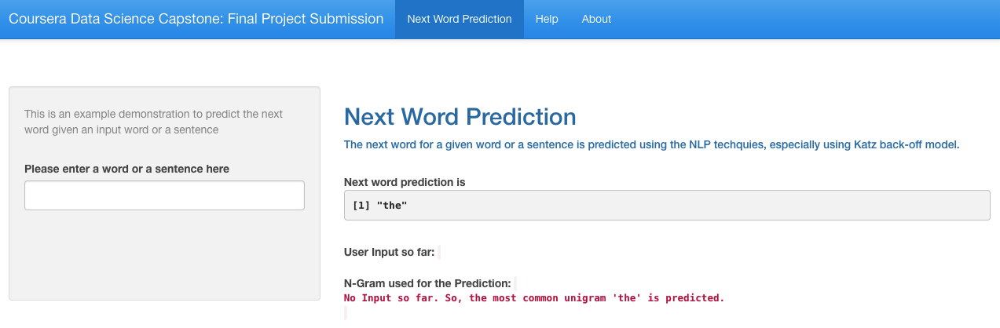
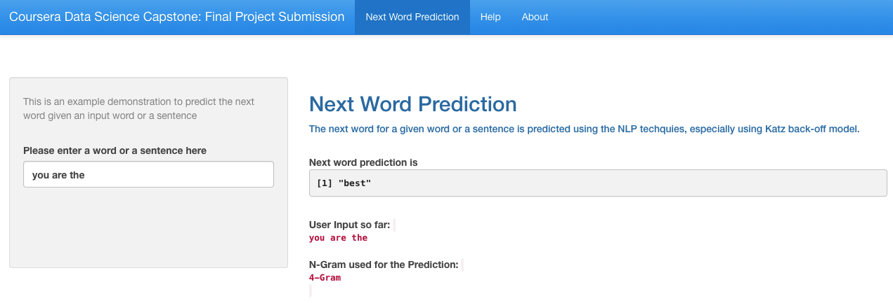

Predicting The Next Word
========================================================
author: Gudur Guy
date:   July 9th, 2023
autosize: true
transition: rotate
class: smaller
css: style.css

Coursera Data Science Capstone Application 
Data Science Specialization by Johns Hopkins University 

========================================================
# **Introduction**

<small>
The goal of this project is to develop a Shiny Application 
that can predict the next word based on what the user typed so far.
This presentation describes the dataset used, techniques implemented to predict the next word and the application itself.

The Shiny Application is located at:

<ul>
    <li><a target="_blank" href="https://gudurguy.shinyapps.io/datascience-capstone-app/">https://gudurguy.shinyapps.io/datascience-capstone-app/</a></li>
</ul>

The source code can be found on GitHub:

<ul>
    <li><a target="_blank" href="https://github.com/gudurguy/coursera-datascience-capstone-project">https://github.com/gudurguy/coursera-datascience-capstone-project</a></li>
</ul>

</small>

========================================================
# **Data Set**

<small>
The Data Set for developing this application is provided by Swift Key. This corpora contains textual data from four different languages. But for our application, we used just the english language portion of it. It contains over **4 millions** lines of human readable text and has three different sources:
* Blogs
* News
* Twitter

But for the purposes of the application, the data set that is used is **5%** of randomly selected lines of data. That itself is over a **quarter million** lines of text. 
 
 
Anything beyond this can not be processed in reasonable amount time given the resources of an ordinary machine.

</small>

========================================================
# **Under the Hood**

<small>
The sample data was first cleaned using the **tm** package. As
part of the cleaning process the data was converted to
lowercase, removed all profane words, non-ascii characters,
numbers, punctuation and whitespaces. The data was then tokenized
then generated respective n-grams.

**Katz Back-off Model** is used for the prediction. It works as following:

* To predict the next word, 4-gram is first used.

* If no 4-grams are found, back off to 3-gram.

* If no 3-grams are found, back off to 2-gram.

* If no 2-grams are found, fall back to the most common word i.e. "the".

</small>

========================================================
# **Shiny Application**

<small>
Initial load of the Application can take between 15-20 seconds because of the size of n-grams data (60 MB).
 
 
Once it loads you will see the first predicted word to be **"the"**.
Now the user can start typing in the text box.
</small>

========================================================
# **Shiny Application**

<small>
The next prediction will shown when user finishes typing a word.
 
 
It might take a couple of seconds based on which N-Gram is being used for 
searching for the prediction.
</small>

========================================================
 
 
 
 
 
  
# **Thank you**
